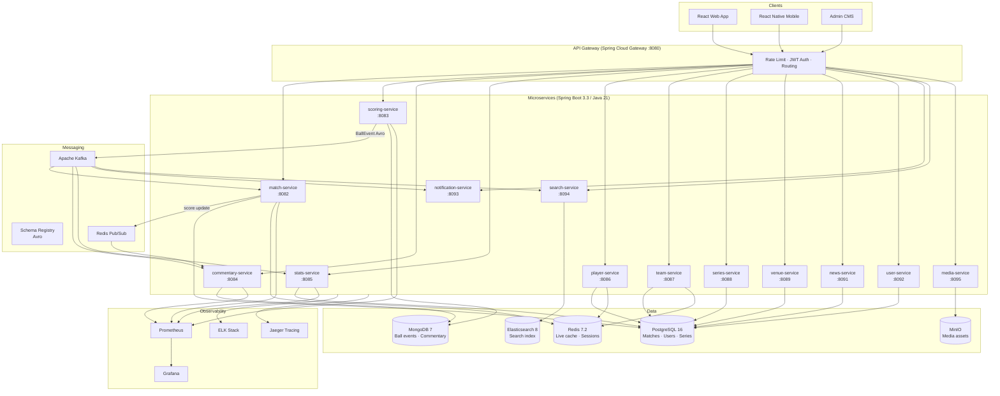
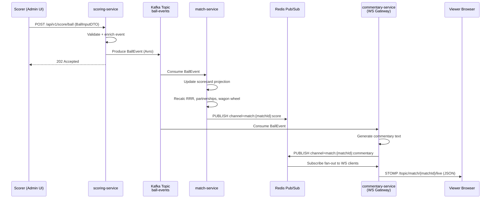
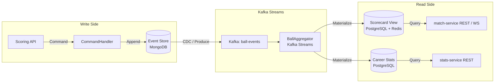
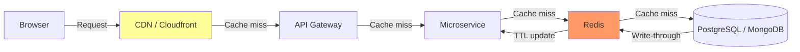
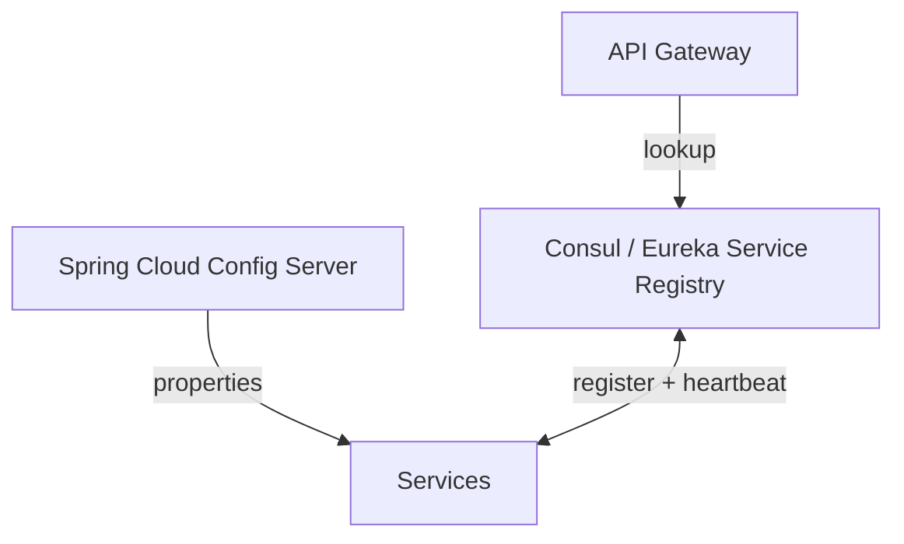
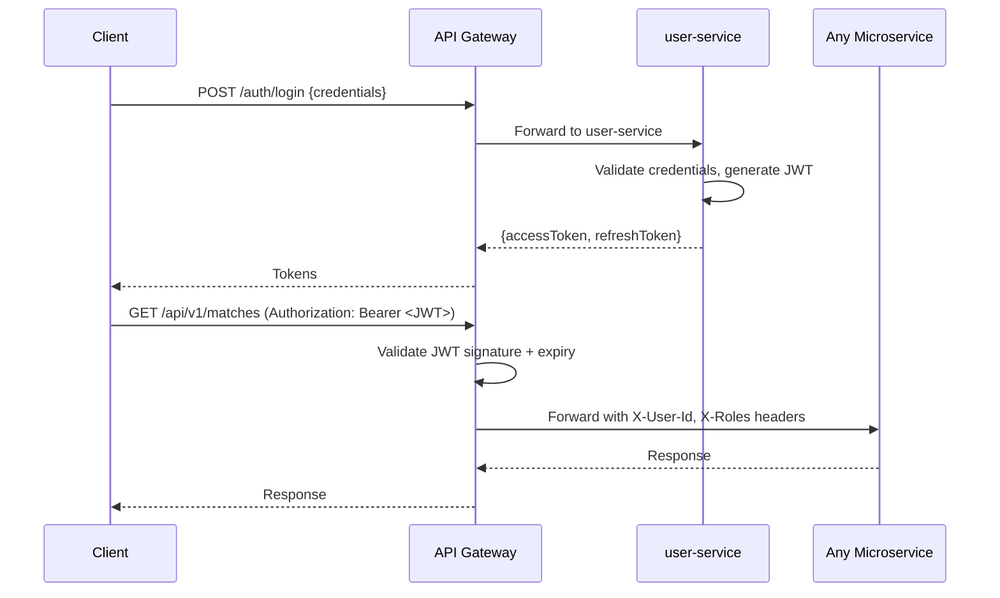
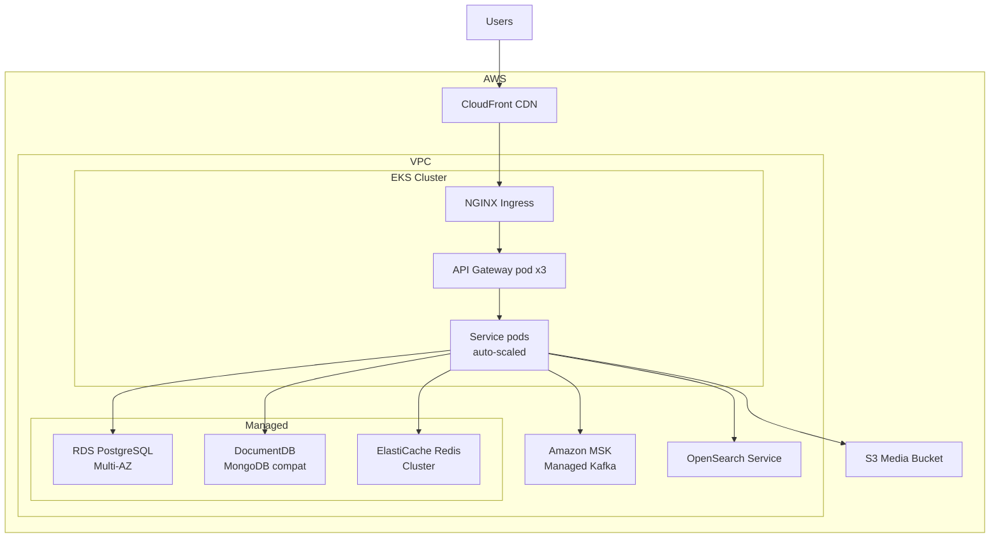

# CrickLive — Architecture

> **Implementation note (2026-10):** the diagrams below show the target architecture. Currently built: match-, scoring- and commentary-service + web. Kafka payloads are JSON (not Avro, no Schema Registry), auth is a shared-secret JWT, and there is no API gateway; see ADR-009 to ADR-012 in [DECISIONS.md](DECISIONS.md).

## 1. High-Level Component Diagram

---

## 2. Real-Time WebSocket Fanout

---

## 3. Event Sourcing — Ball-by-Ball (CQRS)

---

## 4. Caching Strategy

| Data Type | Cache Layer | TTL |
|-----------|-------------|-----|
| Live scorecard | Redis (pub/sub) | Push on event |
| Player profile | Redis | 1 hour |
| Match fixtures | CDN + Redis | 5 min |
| News articles | CDN | 15 min |
| Career stats | Redis | 30 min |
| Search results | Elasticsearch | Query-time |

---

## 5. Service Discovery & Configuration

- **Config Server** externalises all `application.yml` properties.  
- **Service Registry** (Consul preferred for production; Eureka for local) handles dynamic routing.  
- **API Gateway** applies circuit-breaking (Resilience4j) and rate limiting (Redis token bucket).

---

## 6. Security Architecture

- JWT signed with RS256 (asymmetric); public key distributed to all services.  
- Refresh tokens stored in Redis with revocation capability.  
- Service-to-service calls use mTLS inside the cluster.

---

## 7. Deployment Topology (Production)

