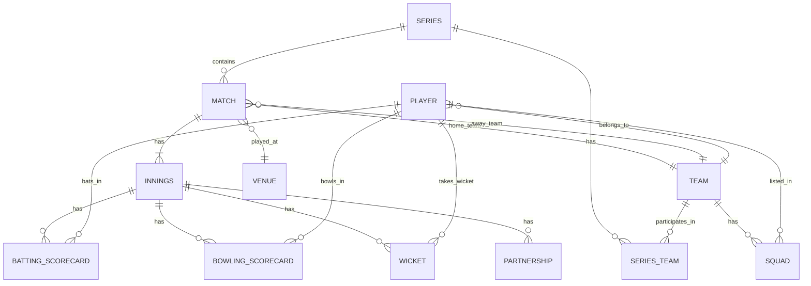

# CrickLive — Data Model

## 1. Entity Relationship Diagram (Core)



---

## 2. PostgreSQL Schemas

### Table: `series`

```sql
CREATE TABLE series (
    id            UUID PRIMARY KEY DEFAULT gen_random_uuid(),
    name          VARCHAR(200) NOT NULL,
    short_name    VARCHAR(50),
    format        VARCHAR(20) NOT NULL CHECK (format IN ('TEST','ODI','T20I','T20','LIST_A','FIRST_CLASS')),
    season        VARCHAR(10),                  -- e.g. "2024-25"
    start_date    DATE NOT NULL,
    end_date      DATE,
    host_country  VARCHAR(100),
    status        VARCHAR(20) NOT NULL DEFAULT 'UPCOMING'
                    CHECK (status IN ('UPCOMING','ONGOING','COMPLETED')),
    created_at    TIMESTAMPTZ NOT NULL DEFAULT NOW(),
    updated_at    TIMESTAMPTZ NOT NULL DEFAULT NOW()
);
```

### Table: `team`

```sql
CREATE TABLE team (
    id             UUID PRIMARY KEY DEFAULT gen_random_uuid(),
    name           VARCHAR(150) NOT NULL,
    short_name     VARCHAR(10) NOT NULL,
    country_code   CHAR(3),                     -- ISO 3166-1 alpha-3
    team_type      VARCHAR(20) NOT NULL CHECK (team_type IN ('NATIONAL','FRANCHISE','ASSOCIATE')),
    flag_url       TEXT,
    home_ground_id UUID REFERENCES venue(id),
    created_at     TIMESTAMPTZ NOT NULL DEFAULT NOW(),
    updated_at     TIMESTAMPTZ NOT NULL DEFAULT NOW()
);
```

### Table: `player`

```sql
CREATE TABLE player (
    id               UUID PRIMARY KEY DEFAULT gen_random_uuid(),
    full_name        VARCHAR(200) NOT NULL,
    display_name     VARCHAR(100) NOT NULL,
    date_of_birth    DATE,
    country_code     CHAR(3),
    role             VARCHAR(30) NOT NULL CHECK (role IN ('BATTER','BOWLER','ALL_ROUNDER','WICKET_KEEPER')),
    batting_style    VARCHAR(30) CHECK (batting_style IN ('RIGHT_HAND','LEFT_HAND')),
    bowling_style    VARCHAR(50),               -- e.g. 'Right-arm fast-medium'
    primary_team_id  UUID REFERENCES team(id),
    debut_date       DATE,
    jersey_number    SMALLINT,
    is_active        BOOLEAN NOT NULL DEFAULT TRUE,
    bio              TEXT,
    profile_image_url TEXT,
    created_at       TIMESTAMPTZ NOT NULL DEFAULT NOW(),
    updated_at       TIMESTAMPTZ NOT NULL DEFAULT NOW()
);
```

### Table: `venue`

```sql
CREATE TABLE venue (
    id          UUID PRIMARY KEY DEFAULT gen_random_uuid(),
    name        VARCHAR(200) NOT NULL,
    short_name  VARCHAR(80),
    city        VARCHAR(100) NOT NULL,
    country     VARCHAR(100) NOT NULL,
    capacity    INTEGER,
    pitch_type  VARCHAR(50),                    -- e.g. 'Flat','Spin-friendly','Seam-friendly'
    latitude    DECIMAL(9,6),
    longitude   DECIMAL(9,6),
    timezone    VARCHAR(50),                    -- IANA tz id
    created_at  TIMESTAMPTZ NOT NULL DEFAULT NOW()
);
```

### Table: `match`

```sql
CREATE TABLE match (
    id               UUID PRIMARY KEY DEFAULT gen_random_uuid(),
    series_id        UUID REFERENCES series(id) ON DELETE RESTRICT,
    match_number     INTEGER,
    format           VARCHAR(20) NOT NULL CHECK (format IN ('TEST','ODI','T20I','T20','LIST_A','FIRST_CLASS')),
    venue_id         UUID REFERENCES venue(id),
    scheduled_start  TIMESTAMPTZ NOT NULL,
    actual_start     TIMESTAMPTZ,
    status           VARCHAR(20) NOT NULL DEFAULT 'UPCOMING'
                       CHECK (status IN ('UPCOMING','TOSS','LIVE','INNINGS_BREAK','RAIN_DELAY','COMPLETED','ABANDONED','NO_RESULT')),
    home_team_id     UUID REFERENCES team(id),
    away_team_id     UUID REFERENCES team(id),
    toss_winner_id   UUID REFERENCES team(id),
    toss_decision    VARCHAR(10) CHECK (toss_decision IN ('BAT','FIELD')),
    result_type      VARCHAR(20) CHECK (result_type IN ('WIN','DRAW','TIE','NO_RESULT','ABANDONED')),
    winning_team_id  UUID REFERENCES team(id),
    win_margin       INTEGER,
    win_margin_unit  VARCHAR(10) CHECK (win_margin_unit IN ('RUNS','WICKETS')),
    dls_applied      BOOLEAN NOT NULL DEFAULT FALSE,
    notes            TEXT,
    created_at       TIMESTAMPTZ NOT NULL DEFAULT NOW(),
    updated_at       TIMESTAMPTZ NOT NULL DEFAULT NOW()
);
```

### Table: `innings`

```sql
CREATE TABLE innings (
    id               UUID PRIMARY KEY DEFAULT gen_random_uuid(),
    match_id         UUID NOT NULL REFERENCES match(id) ON DELETE CASCADE,
    innings_number   SMALLINT NOT NULL CHECK (innings_number BETWEEN 1 AND 4),
    batting_team_id  UUID NOT NULL REFERENCES team(id),
    bowling_team_id  UUID NOT NULL REFERENCES team(id),
    total_runs       INTEGER NOT NULL DEFAULT 0,
    wickets          SMALLINT NOT NULL DEFAULT 0,
    overs_completed  DECIMAL(5,1) NOT NULL DEFAULT 0,
    extras_total     INTEGER NOT NULL DEFAULT 0,
    extras_wides     INTEGER NOT NULL DEFAULT 0,
    extras_no_balls  INTEGER NOT NULL DEFAULT 0,
    extras_byes      INTEGER NOT NULL DEFAULT 0,
    extras_leg_byes  INTEGER NOT NULL DEFAULT 0,
    extras_penalty   INTEGER NOT NULL DEFAULT 0,
    declared         BOOLEAN NOT NULL DEFAULT FALSE,
    follow_on        BOOLEAN NOT NULL DEFAULT FALSE,
    status           VARCHAR(20) NOT NULL DEFAULT 'NOT_STARTED'
                       CHECK (status IN ('NOT_STARTED','IN_PROGRESS','COMPLETED','DECLARED')),
    target           INTEGER,                   -- DLS or follow-on target
    created_at       TIMESTAMPTZ NOT NULL DEFAULT NOW(),
    updated_at       TIMESTAMPTZ NOT NULL DEFAULT NOW(),
    UNIQUE (match_id, innings_number)
);
```

### Table: `batting_scorecard`

```sql
CREATE TABLE batting_scorecard (
    id            UUID PRIMARY KEY DEFAULT gen_random_uuid(),
    innings_id    UUID NOT NULL REFERENCES innings(id) ON DELETE CASCADE,
    player_id     UUID NOT NULL REFERENCES player(id),
    position      SMALLINT NOT NULL,            -- batting order
    runs          INTEGER NOT NULL DEFAULT 0,
    balls_faced   INTEGER NOT NULL DEFAULT 0,
    fours         SMALLINT NOT NULL DEFAULT 0,
    sixes         SMALLINT NOT NULL DEFAULT 0,
    strike_rate   DECIMAL(6,2) GENERATED ALWAYS AS (
                    CASE WHEN balls_faced = 0 THEN 0
                    ELSE ROUND(runs::DECIMAL / balls_faced * 100, 2) END
                  ) STORED,
    dismissal_type VARCHAR(30) CHECK (dismissal_type IN (
                    'BOWLED','CAUGHT','LBW','RUN_OUT','STUMPED',
                    'HIT_WICKET','HIT_TWICE','HANDLED_BALL',
                    'OBSTRUCTING_FIELD','TIMED_OUT','NOT_OUT','DNB')),
    dismissed_by_bowler_id UUID REFERENCES player(id),
    dismissed_by_fielder_id UUID REFERENCES player(id),
    did_not_bat   BOOLEAN NOT NULL DEFAULT FALSE,
    UNIQUE (innings_id, player_id)
);
```

### Table: `bowling_scorecard`

```sql
CREATE TABLE bowling_scorecard (
    id            UUID PRIMARY KEY DEFAULT gen_random_uuid(),
    innings_id    UUID NOT NULL REFERENCES innings(id) ON DELETE CASCADE,
    player_id     UUID NOT NULL REFERENCES player(id),
    overs         DECIMAL(5,1) NOT NULL DEFAULT 0,
    maidens       SMALLINT NOT NULL DEFAULT 0,
    runs          INTEGER NOT NULL DEFAULT 0,
    wickets       SMALLINT NOT NULL DEFAULT 0,
    wides         SMALLINT NOT NULL DEFAULT 0,
    no_balls      SMALLINT NOT NULL DEFAULT 0,
    economy       DECIMAL(5,2) GENERATED ALWAYS AS (
                    CASE WHEN overs = 0 THEN 0
                    ELSE ROUND(runs::DECIMAL / overs, 2) END
                  ) STORED,
    UNIQUE (innings_id, player_id)
);
```

### Table: `wicket`

```sql
CREATE TABLE wicket (
    id              UUID PRIMARY KEY DEFAULT gen_random_uuid(),
    innings_id      UUID NOT NULL REFERENCES innings(id) ON DELETE CASCADE,
    wicket_number   SMALLINT NOT NULL,
    runs_at_fall    INTEGER NOT NULL,
    batter_id       UUID NOT NULL REFERENCES player(id),
    bowler_id       UUID REFERENCES player(id),
    fielder_id      UUID REFERENCES player(id),
    dismissal_type  VARCHAR(30) NOT NULL,
    over_number     SMALLINT NOT NULL,
    ball_number     SMALLINT NOT NULL,
    UNIQUE (innings_id, wicket_number)
);
```

### Table: `partnership`

```sql
CREATE TABLE partnership (
    id           UUID PRIMARY KEY DEFAULT gen_random_uuid(),
    innings_id   UUID NOT NULL REFERENCES innings(id) ON DELETE CASCADE,
    wicket_number SMALLINT NOT NULL,
    batter1_id   UUID NOT NULL REFERENCES player(id),
    batter2_id   UUID NOT NULL REFERENCES player(id),
    runs         INTEGER NOT NULL DEFAULT 0,
    balls        INTEGER NOT NULL DEFAULT 0,
    batter1_runs INTEGER NOT NULL DEFAULT 0,
    batter2_runs INTEGER NOT NULL DEFAULT 0,
    UNIQUE (innings_id, wicket_number)
);
```

---

## 3. MongoDB Collections (Ball-by-Ball Events)

### Collection: `ball_events`

Each document is an immutable event appended per delivery.

```json
{
  "_id": "ObjectId",
  "eventId": "UUID (idempotency key)",
  "matchId": "UUID",
  "inningsId": "UUID",
  "overNumber": 14,
  "ballNumber": 3,
  "batter": {
    "playerId": "UUID",
    "name": "Virat Kohli"
  },
  "bowler": {
    "playerId": "UUID",
    "name": "Pat Cummins"
  },
  "delivery": {
    "runsScored": 4,
    "runType": "BOUNDARY",
    "extras": {
      "type": null,
      "runs": 0
    },
    "isWicket": false,
    "wicketDetails": null,
    "isNoBall": false,
    "isWide": false,
    "isBye": false,
    "isLegBye": false
  },
  "inningsState": {
    "totalRuns": 156,
    "wickets": 2,
    "currentOver": "14.3",
    "runRate": 7.45,
    "partnershipRuns": 62,
    "partnershipBalls": 48
  },
  "timestamp": "ISODate",
  "scorerId": "UUID",
  "version": 1
}
```

Indexes:
```js
db.ball_events.createIndex({ matchId: 1, inningsId: 1, overNumber: 1, ballNumber: 1 }, { unique: true })
db.ball_events.createIndex({ matchId: 1, timestamp: -1 })
```

### Collection: `commentary`

```json
{
  "_id": "ObjectId",
  "matchId": "UUID",
  "inningsId": "UUID",
  "overNumber": 14,
  "ballNumber": 3,
  "ballEventId": "ObjectId (ref: ball_events)",
  "text": "FOUR! Kohli drives beautifully through the covers — textbook timing.",
  "htmlText": "<b>FOUR!</b> Kohli drives...",
  "eventType": "BOUNDARY",
  "tags": ["BOUNDARY", "DRIVE", "COVER"],
  "author": "system",
  "timestamp": "ISODate",
  "language": "en"
}
```

---

## 4. Redis Key Patterns

| Key Pattern | Type | TTL | Purpose |
|-------------|------|-----|---------|
| `match:{matchId}:scorecard` | Hash | Push on event | Live scorecard |
| `match:{matchId}:batting` | Hash | Push on event | Current batters |
| `match:{matchId}:bowling` | Hash | Push on event | Current bowler |
| `match:{matchId}:overs` | List | Push on event | Over summary list |
| `player:{playerId}:profile` | Hash | 1h | Cached profile |
| `series:{seriesId}:standings` | Sorted Set | 5m | Points table |
| `live:matches` | Sorted Set | 30s | Live match IDs |
| `session:{userId}` | Hash | 24h | User session |
| `rate:{ip}:{minute}` | Counter | 60s | Rate limit |

---

## 5. Elasticsearch Index Mappings

### Index: `players`

```json
{
  "mappings": {
    "properties": {
      "id":          { "type": "keyword" },
      "displayName": { "type": "text", "analyzer": "standard", "fields": { "keyword": { "type": "keyword" } } },
      "fullName":    { "type": "text" },
      "country":     { "type": "keyword" },
      "role":        { "type": "keyword" },
      "isActive":    { "type": "boolean" },
      "teamNames":   { "type": "keyword" }
    }
  }
}
```

### Index: `matches`

```json
{
  "mappings": {
    "properties": {
      "id":          { "type": "keyword" },
      "seriesName":  { "type": "text" },
      "teams":       { "type": "text" },
      "venue":       { "type": "text" },
      "status":      { "type": "keyword" },
      "format":      { "type": "keyword" },
      "scheduledStart": { "type": "date" }
    }
  }
}
```

### Index: `news`

```json
{
  "mappings": {
    "properties": {
      "id":          { "type": "keyword" },
      "title":       { "type": "text", "analyzer": "english" },
      "body":        { "type": "text", "analyzer": "english" },
      "tags":        { "type": "keyword" },
      "publishedAt": { "type": "date" },
      "author":      { "type": "keyword" }
    }
  }
}
```

---

## 6. Avro Schema — BallEvent

Location: `services/scoring-service/src/main/avro/ball_event.avsc`

```json
{
  "namespace": "dev.cricklive.scoring.avro",
  "type": "record",
  "name": "BallEvent",
  "fields": [
    { "name": "eventId",       "type": "string" },
    { "name": "matchId",       "type": "string" },
    { "name": "inningsId",     "type": "string" },
    { "name": "overNumber",    "type": "int" },
    { "name": "ballNumber",    "type": "int" },
    { "name": "batterId",      "type": "string" },
    { "name": "bowlerId",      "type": "string" },
    { "name": "runsScored",    "type": "int" },
    { "name": "isWicket",      "type": "boolean", "default": false },
    { "name": "dismissalType", "type": ["null","string"], "default": null },
    { "name": "isWide",        "type": "boolean", "default": false },
    { "name": "isNoBall",      "type": "boolean", "default": false },
    { "name": "isBye",         "type": "boolean", "default": false },
    { "name": "isLegBye",      "type": "boolean", "default": false },
    { "name": "extraRuns",     "type": "int",     "default": 0 },
    { "name": "timestamp",     "type": "long",    "logicalType": "timestamp-millis" },
    { "name": "scorerId",      "type": "string" }
  ]
}
```
